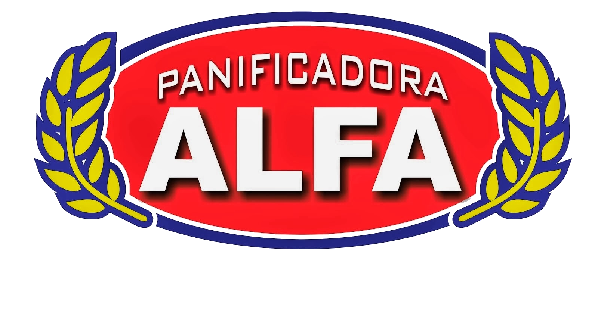

# Projeto PHP e MYSQL
## Entrega do Projeto de criação de um site para uma padaria e desenvolvimento do seu cms(sistema de gerenciamento de conteúdo).

- Matéria : Programação web beck-end
- Professor : Marcel Neves Teixeira
- SENAI Jandira | Desenvolvimento de sistemas

### Praticas desenvolvidas com o Projeto:
- Integração de PHP com banco de dados MySQL
- Responsividade com CSS
- JQuerry para desenvolvimento de slider e menu mobile
- JavaScript Vanilla para validação de formulario
- Validação de HTML e CSS no W3C
- Ajax e js Vanilla para criação de modais

